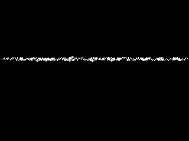
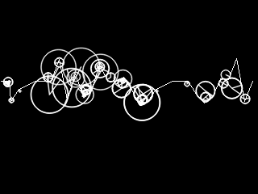

# EEGWave 

This program takes a monochannel signal, a time series of doubles, and converts that signal into an image, a standardized plot.  It takes the image and use a variant of the SIFT descriptor to capture their visual shape and retuns a descriptor which represents that shape.




It is aimed to be used in Neuroscience research and applications. This allows to search or compare against specific templates and to verify
if wavepatterns are presented in a given signal segment.

The library uses:

- OpenCV 4.x
- LSL: Labstreamlayer protocol for connecting to EEG sources (956a7137e588a4bc0c9618a4451d6ebc6b66966b)

# Usage

```
import pybcisift
import numpy as np
el = np.zeros((1,256))
el[0,23]=200
descr = pybcisift.extract(el.tolist()[0])
print(descr)
print(len(descr))
```

The list 'descr' is a SIFT^ descriptor which represents the signal shape, and can be used later for comparision.

## Compiling and running

It is better to first create and activate a venv environment

```
 python3 -m venv ew
 . ./ew/bin/activate
```

This will allow the module to be installed inside the virtual environment.


```
 make clean
 export OpenCV_DIR=LOCATION
 make
 make libshared
 . ./ew/bin/activate # Activate any environment that you may have
 cd pyeegwave
 python setup.py build install
```

```
export LD_LIBRARY_PATH=$OpenCV_DIR:pyeegwave/
python test.py
```

## Ubuntu Installation

# OpenCV

```
 sudo apt install -y cmake g++ wget unzip
 sudo apt install libgtk2.0-dev pkg-config
 sudo apt install clang2
 sudo apt install python3-dev python3-venv
 ```

Follow the guidelines from https://docs.opencv.org/master/df/d65/tutorial_table_of_content_introduction.html 
Download and unpack sources

```
 wget -O opencv.zip https://github.com/opencv/opencv/archive/master.zip
 wget -O opencv_contrib.zip https://github.com/opencv/opencv_contrib/archive/master.zip
 unzip opencv.zip
 unzip opencv_contrib.zip 
 ```

```
 cd opencv-master
 mkdir -p build
 cd build
 cmake -DCMAKE_INSTALL_PREFIX=/home/user/opencv/ -DOPENCV_EXTRA_MODULES_PATH=../../opencv_contrib-master/modules ..
 cmake --build .
 sudo make install
 ```
 
# LSL

```
 wget https://github.com/sccn/liblsl/releases/download/v1.14.0/liblsl-1.14.0-bionic_amd64.deb
 sudo dpkg -i liblsl-1.14.0-bionic_amd64.deb
 (use https://github.com/sccn/liblsl/releases/download/1.13.0/liblsl-1.13.0-Linux64-bionic.deb for ubuntu 18)
```


## Refs

* http://tilomitra.com/opencv-on-mac-osx/
* http://stackoverflow.com/questions/21811858/opencv-mac-os-x-qt-creator-strange-linking-bug
* https://developer.apple.com/library/archive/documentation/DeveloperTools/Conceptual/DynamicLibraries/100-Articles/UsingDynamicLibraries.html
* https://learn.microsoft.com/es-es/windows/wsl/install


